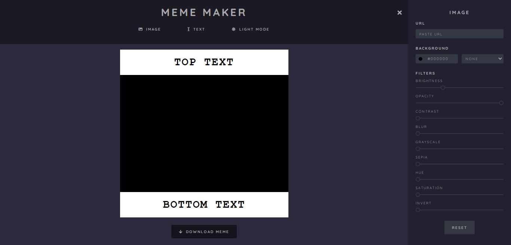
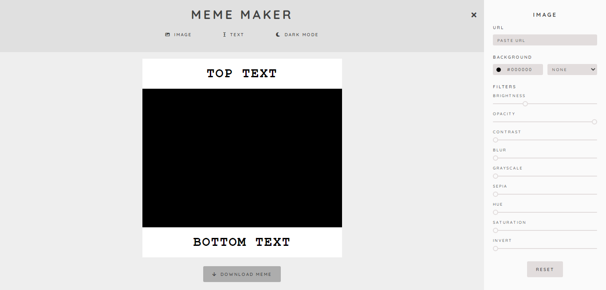

# Proyecto Editor de memes - (ES)

## Podés verlo haciendo click [acá.](https://lucilaguajardo.github.io/meme-maker-project/)

## Contenidos

* [Descripción](#descripción)
* [Avances](#avances)
* [Tecnologías](#tecnologías)
* [Dependencias](#dependencias)
* [Agradecimientos](#agradecimientos)

### Descripción

Este es el segundo proyecto del **Curso de Desarrollo Front-End de AdaITW** y pertenece al *Módulo 2: JavaScript*. Se trata de una aplicación pensada para crear memes divertidos, que brinde herramientas para editar y combinar textos e imágenes de forma dinámica.

### Avances

Vista previa de modo oscuro

Vista previa de modo claro

### Tecnologías

* HTML5
* CSS3
* JavaScript

### Dependencias

Este proyecto no requiere instalación de ninguna dependencia por el momento.

### Agradecimientos

* A [Jonh](https://github.com/Jonhks) y [Leydy](https://github.com/leydyk93)

---

# Personal Portfolio Project - (EN)

## You can check it out by clicking [here.](https://lucilaguajardo.github.io/meme-maker-project/)

## Contents

* [Description](#description)
* [Technologies](#technologies)
* [Dependencies](#dependencies)
* [Thanks](#thanks)

### Description

This is the second project from **AdaITW's Front-End Development Course** and it belongs to *Module 2: JavaScript*. It's about an app created to make funny memes, which had to provide tools to edit and combine texts and images dynamically.

### Technologies

* HTML5
* CSS3
* JavaScript

### Dependencies

This project does not require installation of any dependencies at the moment.

### Thanks

* To [Jonh](https://github.com/Jonhks) and [Leydy](https://github.com/leydyk93)